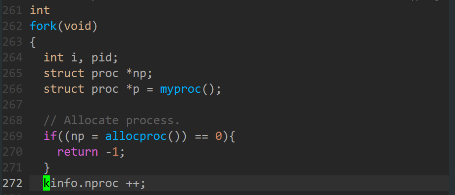
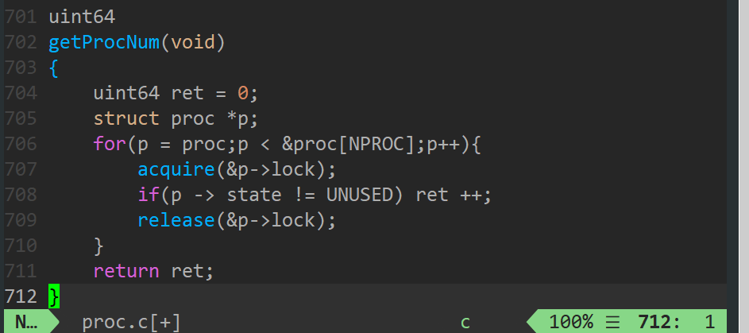

# 6.s081 -- syscall

​		在做MIT 6.S081实验过程中，多次参考了别人的代码，故记下做实验过程中需要注意的地方及方法，作为自己成长的记录吧。

​		本次实验对应着xv6book的chapter2以及4-3 and 44 of chapter4。

### ①trace

​		添加一个syscall以追踪mask所代表的各个syscall，用一个整型数mask标记需要追踪的系统调用，各个系统调用的定义在 kernel/syscall.h 中，如下：

用户程序 user/trace.c 已经存在，其中调用了trace系统调用，本次实验需要实现trace的系统调用。

#### 1.添加user下的syscall接口

usys.pl是用以生成usys.S的脚本文件，在此处添加 entry（“trace”）

#### 2.在syscall.h添加相应的syscall定义

syscall.c为从user转到kernel运行的程序，其中包含了从用户态获取指针、数据参数的函数，对系统调用函数的申明，以及一个函数指针数组，数组中的元素为指向系统调用函数的指针。

从usys.pl中可以看到将syscall存放在了a7寄存器中，则通过进程a7寄存器的读取可以得到调用的是哪一个syscall。

#### 3.在struct proc 中添加mask成员

#### 4.mask成员的动态调整

添加一个mask元素，在trace系统调用执行时，将当前进程的mask赋值，由提示：

从user传参数到kernel通过register实现，

xv6 book中提到了几个读取user参数的函数，都通过argraw函数实现。读取进程trapframe中的特定寄存器。

由其他syscall猜测一个参数时通过a0传递。

Modify `fork()` (see `kernel/proc.c`) to copy    the trace mask from the parent to the child process.

#### 5.在函数调用返回时，通过对比mask决定是否输出

You have to modify  the xv6 kernel to print out a line when each system call is about to  return, if the system call's number is set in the mask

需要添加一个字符串数组，对应着相应sycall的名字。

调用返回时判断是否是需要追踪的函数调用。

#### 6.测试结果

### ②sysinfo

第二个系统调用的实现有很多与trace的实现相同，就不再赘述，说明一下需要注意的地方。

#### 1.sysinfo在user下的使用

sysinfo定义在 kernel/sysinfo.h 下，user/sysinfotest 中用到了该结构，故需要在user.h中添加该结构体的申明（对于一个大的项目的编译链接不太清楚，后需要进行深入的学习）

其他很多与trace相同的地方略过。

#### 2.sys_sysinfo()函数

/kernel/sysfile.c 与 /kernel/sysproc.c 分别是关于系统文件和系统进程的系统调用，由于sysinfo记录了关于运行进程的数据，于是放在了sysproc.c中，不过若放在sysfile.c也可。

实验的几个步骤：

##### ①获取用户传递的参数，该参数为struct sysinfo的地址

​		sysinfo结构体的地址通过寄存器a0传递到了进程的a0寄存器，则通过argaddr便可得到，与trace类似。

##### ②获取内核的freemem、nproc数据

​		内核freemen、nproc的数据的获取有两种方法：

###### 		1.在内核态中定义一个sysinfo结构体kinfo，在每一次内存分配、释放，每一次fork(),exit()对其进行调整维护。

​		其中mem的维护为：

​		定义sysinfo结构体，在kinit中对其进行初始化。

​		

​		每一次kfree()运行时freemem的大小增加一个PGSIZE，即一个页的大小，每一次kalloc运行时freemem的大小减少一个PGSIZE。

​	

​		nproc的调整：

​		在最初的nproc的大小初始化为0（在kinit()中)，进程的增加通过fork()实现，当进程exit()返回，进程数减少一个。

​		

###### 		2.在proc.c 与 file.c 添加两个函数，以获取freemem与nproc的值

##### ③将这两个数据拷贝到用户态下的struct sysinfo地址

重点是copyout函数，将kernel下的数据拷贝到进程页表下相应地址的位置。

​	

#### 3.测试结果

