### Pagetable

 pagetable_t, which is really a pointer to a RISC-V root page-table page  

xv6系统有一个内核页表，每个进程有一个进程页表。

##### vm.c

walk() -- 根据虚拟地址查找PTE

mappages() -- 将映射存储到PTE

kvm -- 操控内核页表

uvm -- 操作用户页表

copyin() copyout() -- 实现从进程地址提取数据或传输数据

##### boot sequence

kvminit() -- 通过kvmmake创建一个内核页，发生在分页之前，所以是直接映射，之后通过kvmmap将映射写入页表

proc_mapstacks() -- 为每个进程分配一个内核栈

mappages() -- call walk 找到某个虚拟地址PTE的地址，之后将相应的数据存储

walk() -- 查找PTE时模仿RISC-V的分页硬件，若PTE is not vaild ，alloc 一个新的页，并返回最底层的PTE

main中调用kvminithart创建内核页表，并将根页表地址写入satp，之后CPU通过内核页表进行地址转换

##### TLB

xv6改变页表时需要告知CPU对TLB进行调整，sfence.vma in kvminithart 可以刷新CPU的TLB表。

xv6使用的物理地址是  --  从内核的结束到PHYSTOP

空闲地址通过一个空闲页链表进行维护

##### kalloc.c

 17 struct run {
 18   struct run *next;
 19 };
 20 
 21 struct {
 22   struct spinlock lock;
 23   struct run *freelist;
 24 } kmem;

kmem为一个维护空闲页表的结构。

**xv6 assumes that the machine has 128 megabytes of RAM**  

**PGROUNDUP** -- 得到地址对应的以4096对齐的上界地址

kfree释放内存时将所有的地址单元设置为1，使得内存在释放后不会被提取出旧的有效信息。头插法将页插入freelist

进程地址空间中，堆栈下面有一个guard page -- 一个不可访问的页，用以监测是否堆栈溢出

**Sbrk is the system call for a process to shrink or grow its memory**  -- implemented by the function growproc in proc.c

**growproc**() -- 根据参数的正负调用**uvmalloc** 和 **uvmdealloc** (vm.c) 

**uvmalloc**  -- **kalloc**  , adds PTEs to the user page table with **mappages**  

**uvmdealloc** -- **uvmunmap** uses **walk** and **kfree**

## Print a page table ([easy](https://pdos.csail.mit.edu/6.828/2020/labs/guidance.html))

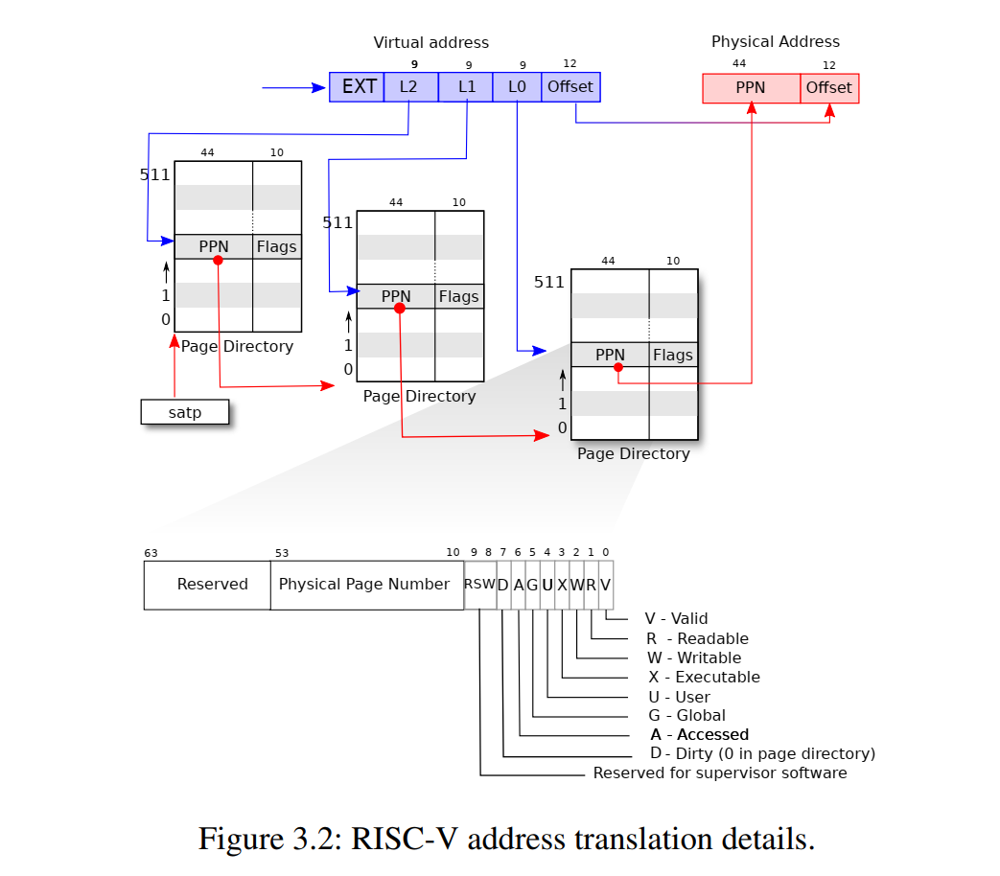

myproc()->pagetable存储了顶层的页表目录，本实验需要遍历打印页表，riscv.h中的宏定义的根据就是上图。

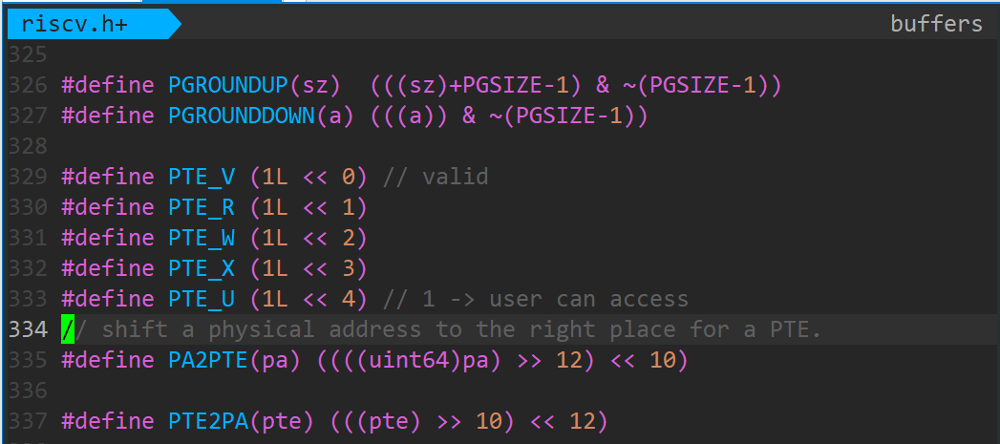

**#define PTE2PA(pte) (((pte) >> 10) << 12)** 通过移位运算可查找到下一层页表的物理地址。

通过递归可实现页表的打印，但test faild.有空再查找原因

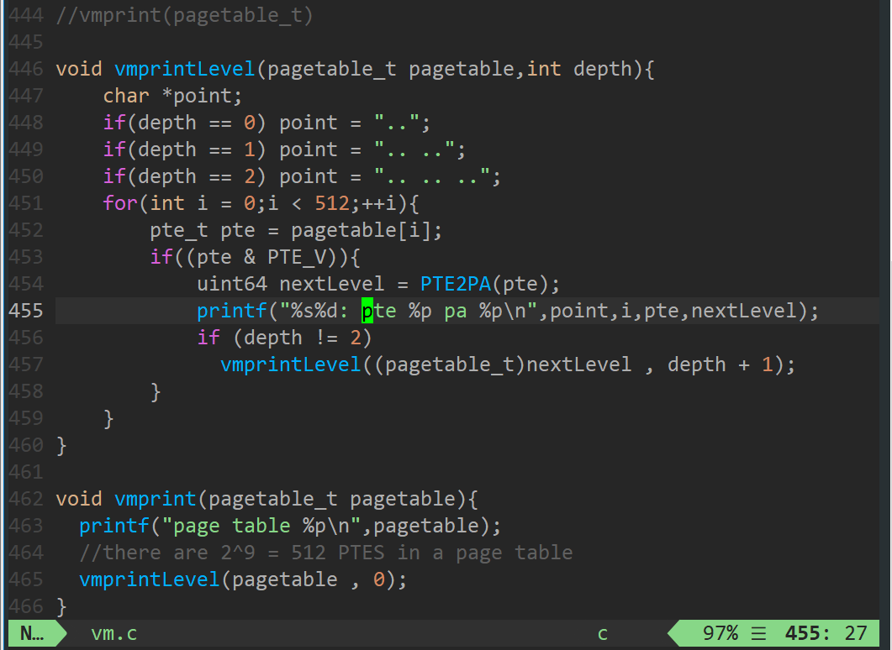

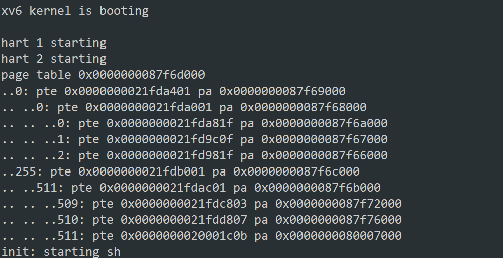

## 对内核页表和进程页表的理解

这一块的认识欠缺太大了，这也是这个实验做得如此之慢的重要原因，对于自己不清楚的东西总有一种畏惧感，希望以后能改变。

每一个进程有自己的页表，当程序中使用虚拟地址映射到物理地址时，它可以用来实现进程的隔离，即每个进程的页表是不同的，虚拟地址所映射到的物理地址必然不会发生冲突。

重点在于进程页表与内核页表的关系与交互：

在此写下自己的一些理解与猜想，在系统启动时，会对向内核分配其所需要的内存空间，在xv6中有一个kernelpagetable，用于存放所分配的内存空间的映射，这个页表就是内核页表；在每一个进程中有一个kstack，

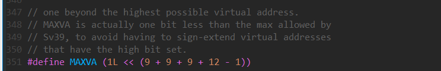

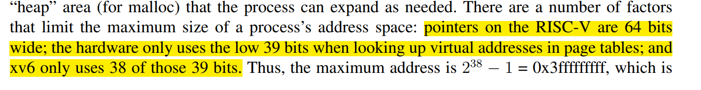

在xv6 book中提到，RISC-V只用到了39位地址的低38位，则此处的MAXVA比实际上的最高可使用的虚拟地址大1bit。

刚开始以为KSTACK在procinit()，是分配在用户进程空间中的，越想越不对劲，procinit()是在系统启动时对所有进程(未分配的进程，但已经占据了内存空间)进行的初始化。

实际上在param中已经将NCPU、NPROC的宏定义给出，那么此处是对所有所有进程空间kstack申请一个page，并将其映射到内核页表当中。

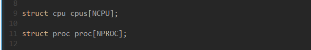

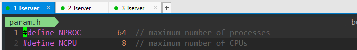

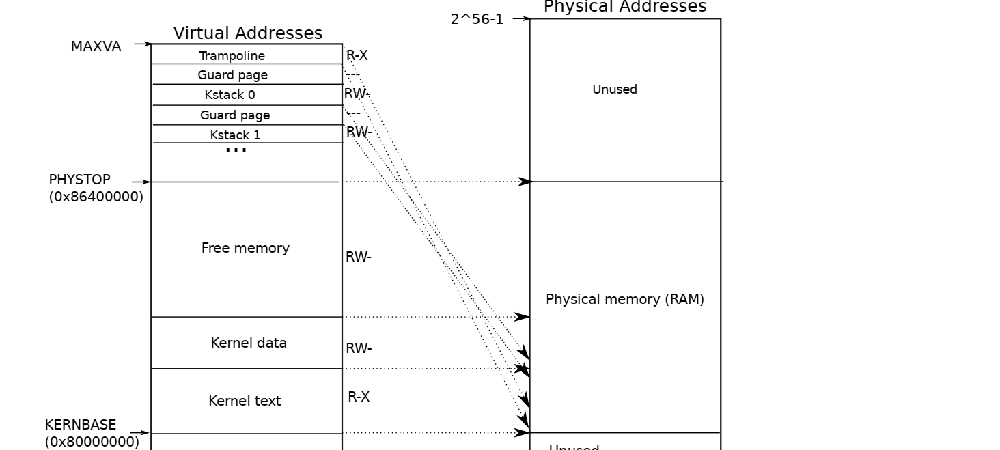

## scheduler()函数的理解

在kernel/main.c的最后使用了scheduler()函数，进行进程的调度

## A kernel page table per process ([hard](https://pdos.csail.mit.edu/6.828/2020/labs/guidance.html))

这个实验卡了好久好久，做得想哭，甚至想放弃，网上的各个blog写得也不清楚（对xv6源码的理解不够），于是转头从源码开始学习，看了/kernel/main.c里面初始化的一些代码， vm.c  kalloc.c  

riscv.h   memlayout.h proc.c 的重要函数都看了一下，终于是有了一点自己的感悟。

xv6 拥有一个单独的内核页表供所有进入内核的进程使用，该页表与实际物理内存直接映射，不需要转换地址。
 但如果想使用用户态的一个地址时，当内核态需要使用一个用户态指针时，需要翻译转换虚拟地址为物理地址。因此，本实验的目标是给每个进程创建一个[内核态页表]，之前一直不理解，这个内核态页表怎么用，又是怎么切换的。

实际上，本次实验相当于给每一个进程添加一个页表，通过这个页表，这个页表的映射与内核页表相同，那么当切换为内核态时，就可以使用proc结构中的这个内核页表实现内核态对用户态中地址的访问。因为在这之前，内核态若需要访问proc中的地址，需要进行转换（还不太清楚，需要深入学习）。

### 1. 在proc中添加kernelpt元素

每个proc都需要一个页表，那么需要在proc.c / struct proc中添加 ：

当发生用户态 --》 内核态切换时，可以直接切换到这个内核页表

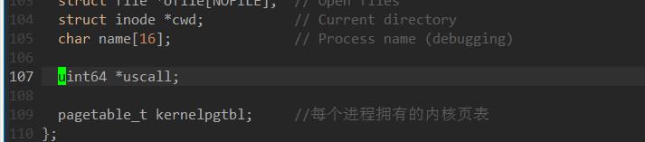

### 2.在vm.c中添加这个页表的映射函数

在进程初始化时，我们需要将这个内核页表进行初始化，添加和原有内核页表相同的映射，关于虚拟地址、映射等的函数都在vm.c中，我们在其中添加相应的关于用户进程中内核页表的映射。

添加映射的方式类似于kvminit()，为用户页表添加这个映射。

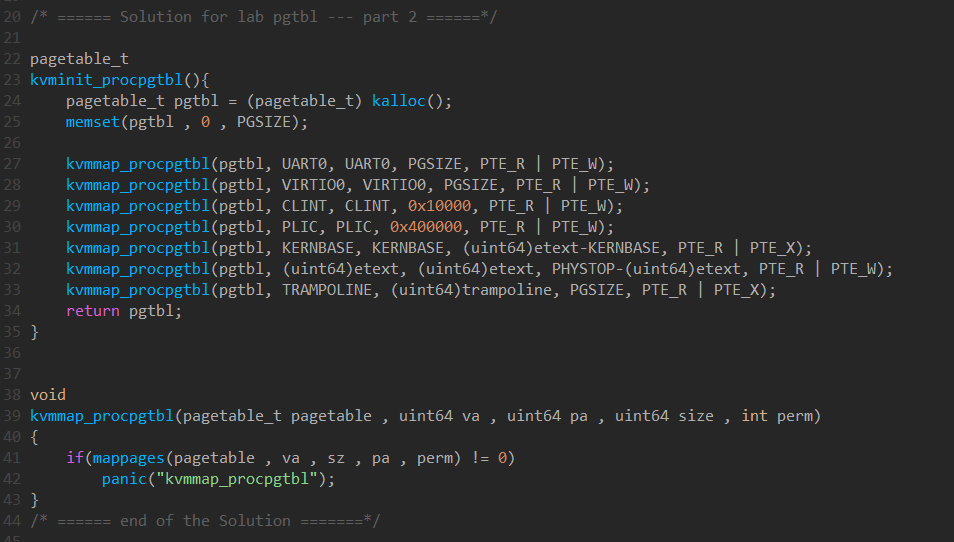

在defs.h中添加函数申明，使得proc中可调用

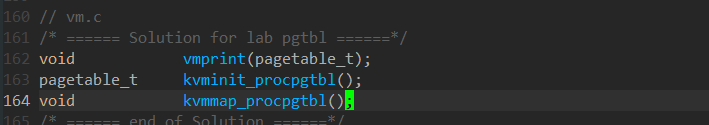

### 3.在/kernel/proc.c/allocproc()中对进程内核页表初始化

首先在allocproc()中为每个分配的进程分配并初始化一个进程内核页表。

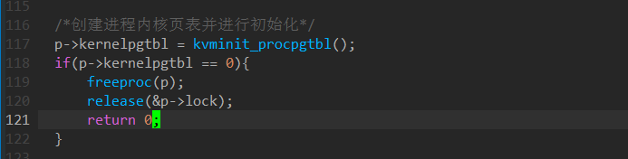

之后将原来的，将每个进程的kstack空间映射到内核页表的代码进行注释，在这之后，将每个进程的kstack映射到进程内核页表中。

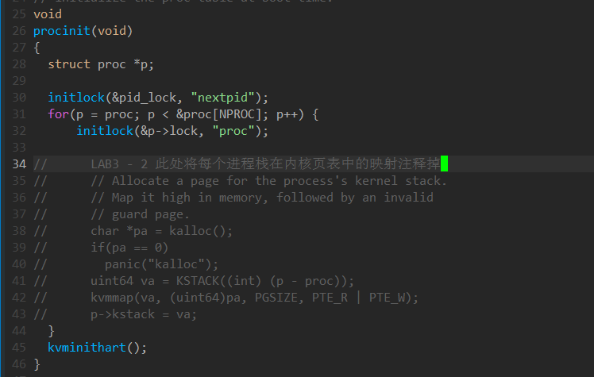

在分配每一个进程时，对每个进程的kstack进行分配，并映射到每个进程的进程内核页表中。

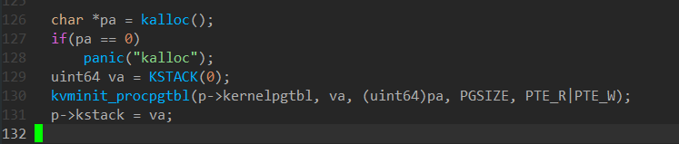

### 4.修改进程调度函数加载进程内核页表到satp寄存器

SATP(Supervisor Address Translation and Protection) ，每个CPU都有自己的SATP

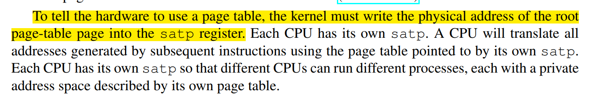

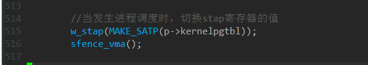

### 5.进程内核页表和内核栈的释放

进程释放时会调用freeproc()函数，在这里将这个进程相关的内存空间释放。

进程内核页表的释放只需要释放页表所在空间，因为内核空间是所有进程共享的，而进程Stack是每个进程都有的，所以需要将该栈进行释放。

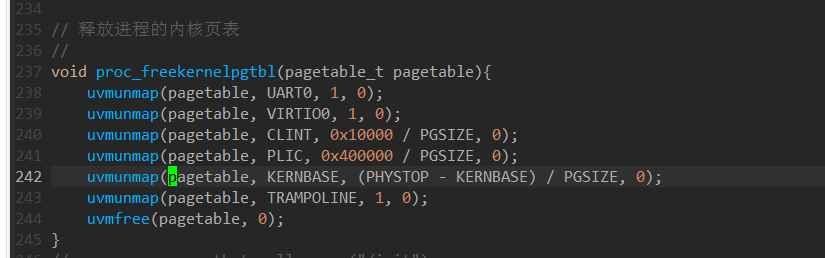

### 6.kvmpa()函数的更改

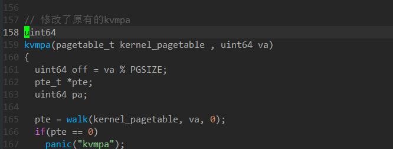

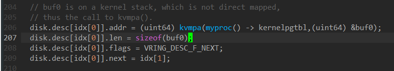

echo "add-auto-load-safe-path xv6-labs-2020/.gdbinit " >> ~/.gdbinit

