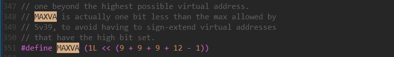
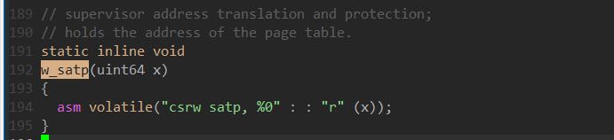

/kernel/Main.c

## 1. kinit()

  Kinit调用了spinlock的一些函数，spinlock设置了一个结构体：

Kinit中初始化了锁，是否上锁由spinlock中的 locked实现，locked == 1即为上锁，locked==0 即为开锁

## 2. kvminit()

此函数为内核创建了一个直接映射的页表，首先通过kalloc申请一个页，

kalloc中kinit先初始化了内存管理，内存通过一个结构体进行管理，lock对内存的分配与释放进行互斥管理，freelist记录了可以分配的页的地址。

### **memset(void *dst,int c ,uint n)  /kernel/string.c**

对dst指针所指向的n个字节进行赋值。

**kvmmap(uint64 va , uint64 pa , uint64 sz , int perm)**

为内核页表添加映射

为起始于va的虚拟地址添加PTES(Pagetable Entries) --- 即物理地址页的页入口

### mappages()

walk返回了第三层页表中对应索引的地址

由于walk的过程中，PTE2PA丢失了之前页表中的Flags内容，所以各个标志位应该重新置位。

perm为mapping过程中设置的Flags参数

 ***pte = PA2PTE(pa) | perm | PTE_V;**    将va虚拟地址第三层页表项对应的PPN(Physical Page Number)存储pa物理地址的页号

mappages只是在页表中将该页表项进行了处理，通过va找到该虚拟地址对应的页表项的位置，再通过对该页表项的值赋予pa的页号便可以添加映射。但pa对应的地址还未分配，（可能等到后续访问该页时发生缺页异常，从而将使用该PPN对应的物理地址。）

 #define PGROUNDDOWN(a) (((a)) & ~(PGSIZE-1))  将底十二位置零

#define PGROUNDUP(sz)  (((sz)+PGSIZE-1) & ~(PGSIZE-1)) 将页的最高地址处低十二位置零

 #define PA2PTE(pa) ((((uint64)pa) >> 12) << 10)  --- 将物理地址转换为相应的PTE

#define PTE2PA(pte) (((pte) >> 10) << 12)   --- 将PTE转换为相应页的物理地址

PTE与PA的关系为：

### pte_t *  walk(pagetable_t pagetable, uint64 va, int alloc)

返回虚拟地址对应的PTE，若该页并未加载到内存中则会创建该页

alloc表示当该虚拟地址的页未映射时，是否对其进行分配。

return value:

success:  返回虚拟地址所在物理地址的页

failure： 该虚拟地址所在的页还没有映射到物理地址

页表为三层映射，使用的是 risc-v Sv39，即虚拟地址为39位，

#define PGSHIFT 12  // bits of offset within a page 

#define PX(level, va) ((((uint64) (va)) >> PXSHIFT(level)) & PXMASK)  ---  取出虚拟地址的中每一层对应的索引。即VA中的L2,L1,L0.

#define MAXVA (1L << (9 + 9 + 9 + 12 - 1)) 

## kvminithart()

函数首先设置了SATP寄存器，

### w_satp(uint64)

用到了MAKE_SATP宏定义：

SATP_SV39: 最高位为1的长64位的数

MAKE_STAP: 根页表地址的高位与SATP_SV39进行组合，MODE位被置为8，将satp寄存器配置为RV64，虚拟地址长39位。

sfence_vma： 刷新所有的TLB

​             

## procinit()

每个proc struct有一个spinlock 结构体，用于进程的互斥访问

pid_lock : 用于pid分配与回收的互斥访问

kalloc 从freememlist中取一个page返回，pa指向该页

