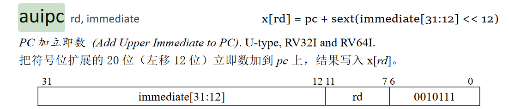
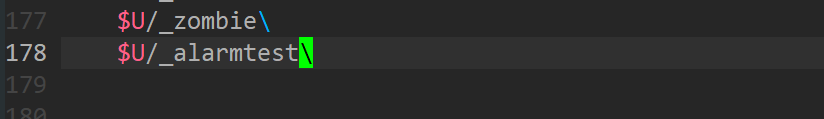
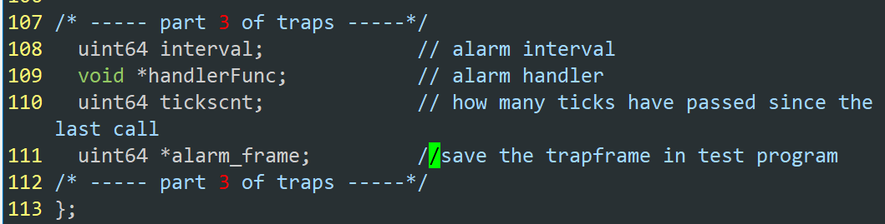

# LAB4 --- TRAP

## GDB调试的一些问题

print---查看程序运行中的变量

x---显示内存值 

x/2c 0xde2---显示0xde2虚拟地址处开始的2个字符


## RISC-V assembly ([easy](https://pdos.csail.mit.edu/6.828/2020/labs/guidance.html))

It will be important to understand a bit of  RISC-V assembly, which you were exposed to in 6.004. There is a file  `user/call.c` in your xv6 repo.  make fs.img compiles it  and also produces a readable assembly version of the program in  `user/call.asm`.

Read the code in call.asm for the functions `g`, `f`, and `main`.  The instruction  manual for RISC-V is on the [reference page](https://pdos.csail.mit.edu/6.828/2020/reference.html).  Here are some questions that you should answer (store the answers in  a file answers-traps.txt):   

#### 1. Which registers contain arguments to functions?  For example, which  register holds 13 in main's call to `printf`?  

**RISC-V的函数调用过程参数优先使用寄存器传递，即a0~a7共8个寄存器。返回值可以放在a0和a1寄存器。printf的参数13保存在a2寄存器。**


#### 2.  Where is the call to function `f`    in the assembly code for main? Where is the call to `g`?  (Hint: the  compiler may inline functions.)  

**汇编代码如上，printf转换而来的汇编代码不存在f function 和 g function的调用，都被编译器进行了内联优化。**

#### 3. At what address is the    function `printf` located?  

**位于0x628开始的位置**


如下对生成的riscv汇编代码中main函数的调用进行分析进行分析：

其中所用到的RISCV指令为：





main函数的汇编代码如下：


1. 将ra与s0入栈存储，由于采用的是riscv:rv64架构，故每个寄存器占8bytes

   

2. 将需要传递的参数存放到寄存器a2,a1中

3. 对a0的处理每太明白

4. 将 ra + 1528 -> pc同时pc + 4 -> ra

####     4. What value is in the register `ra`    just after the `jalr` to `printf` in `main`?  

```
跳转并链接指令（jal）具有双重功能。若将下一条指令PC + 4的地址保存到目标寄存器中，通常是返回地址寄存器ra，便可以用它来实现过程调用。如果使用零寄存器（x0）替换ra作为目标寄存器，则可以实现无条件跳转，因为x0不能更改。像分支一样，jal将其20位分支地址乘以2，进行符号扩展后再添加到PC上，便得到了跳转地址。
跳转和链接指令的寄存器版本（jalr）同样是多用途的。它可以调用地址是动态计算出来的函数，或者也可以实现调用返回（只需ra作为源寄存器，零寄存器（x0）作为目的寄存器）。Switch和case语句的地址跳转，也可以使用jalr指令，目的寄存器设为x0。
```

ra = 0x38

```
	unsigned int i = 0x00646c72;
	printf("H%x Wo%s", 57616, &i);
```

​    

i = 0x00646c72; ---> 安装LSB的存储方式， 0x72 -- 'r' , 0x6c -- 'l' , 0x64 -- 'd'


####  5. In the following code, what is going to be printed after      `'y='`?  (note: the answer is not a specific value.)  Why  does this happen?       

```
	printf("x=%d y=%d", 3);
```


**应该打印出寄存器a2的值，因为printf会从a2寄存器中读取第三个参数作为y的值。**


## Backtrace ([moderate](https://pdos.csail.mit.edu/6.828/2020/labs/guidance.html))

需要在 /kernel/printf.c中添加一个backtrace()函数，backtrace()可以记录

 **backtrace: a list of the function calls on the stack above the point    at which the error occurred.**

首先分析这个实验需要做什么：

从源头出发：

1.在/user/bttest.c中调用了sleep(1)


2. sleep会使用sys_sleep()系统调用，这在syscall实验中已经学过，不再赘述

3. 在/kernel/sysproc.c中的sys_sleep()中添加对backtrace()的调用

4. backtrace()需要输出在由用户到系统trap过程中，sys_sleep()的栈中保存的stack frame的return address---which the error occured

   由lecture 6中的讲义如下：

   

   5. 在backtrace中通过riscv.h添加的r_tp()获取当前的frame pointer，然后递归获取所有已经入栈的frame

按照提示：

#### 1. 在 /kernel/riscv.h中添加r_fp()函数


.**volatile**的作用是作为指令关键字，确保本条指令不会因[编译器](https://baike.baidu.com/item/编译器/8853067)的优化而省略


#### 2. 在 /kernel/defs.h中添加backtrace()的申明


#### 3. 在/kernel/printf.c中定义backtrace()


#### 4.在/kernel/sysproc.c中 sys_sleep()调用backtrace()


## Alarm ([hard](https://pdos.csail.mit.edu/6.828/2020/labs/guidance.html))

本次实验需要给系统添加一个sigalarm(interval , handler)系统调用，/user/alarmtest.c会用到这个系统调用如图：


sigalarm(interval , handler) ，程序运行在CPU每隔n "ticks" of CPU time，内核将调用fn，当fn调用返回时，会回到它离开的地方（子程序调用返回，继续运行原程序）--- traps的陷入和返回

此次实验需要对trap的过程有充分的了解：


如图，trap的过程可分为如下几步：

- 在sh中通过write系统调用，ecall指令陷入

- ecall之后系统进入内核态，执行trampoline.S中的uservec:

  

  

- 进入usertrap()中，调用syscall()函数

- syscall()中根据tramframe->a7寄存器的值执行相关的sys_write()函数

- syscall()执行完毕后回到usertrap()中，再调用usertrapret()函数，usertrapret()中恢复了部分用户态的内容

- usertrapret()的最后调用了trampoline.S中的userret()恢复用户程序运行时寄存器的值

对于本次实验，过程如下（以test0为例）：

- 在test0中调用SYS_sigalarm系统调用

- 在sys_sigalarm系统调用中对程序的的 struct proc中的数据结构进行更改

- 当 struct proc 中的 interval 不等于 0，在/kernel/trap.c 中的usrertrap()中的时钟滴答中断过程对struct proc 中的 tickcnt进行修改并在 tickcnt == interval 时执行回调函数 handlerFunc

- 回调函数即 test0 中的 periodic函数，在periodic函数中执行了sigreturn 系统调用

- 在sys_sigreturn()中执行对原程序，test0()中的trapframe的恢复

  

#### 1. 修改Makefile

/user/alarmtest.c 是这次实验的测试程序，需要生成它的可执行文件

修改Makefile如下：



#### 2. 在/user/user.h添加函数申明


#### 3. 添加相应的系统调用

程序在用户态下调用system call，对应的生成系统调用入口的程序是usys.pl，


用户态下生成了系统调用入口，还需在内核下写出相应的系统调用函数，其中syscall.h中包含各个系统调用的系统调用号，syscall.c中有各个系统调用函数的申明等。


#### 4. 在/kernel/proc.h中添加相应的数据



#### 5. struct proc结构体的初始化

当程序调用sys_sigalarm系统调用时对proc结构体的变量进行初始化


#### 6. 在/kernel/sysproc.c中编写sys_sigalarm函数对proc struct进行赋值

需要注意的时读取参数时通过寄存器a0,a1读取用户态传过来的参数，第一个参数是int型的，第二个参数是函数指针类型，所以需要用argaddr()函数，这个参数是用户态的回调函数地址。


#### 7. 在 /kernel/trap.c中每隔一个tick对struct proc进行修改

**Every tick, the hardware clock forces an interrupt, which is handled in `usertrap()` in `kernel/trap.c`.**

每次滴答，硬件是时钟都会产生一个中断，该中断在/kernel/trap.c中的usertrap()中处理，由devintr()函数可知，当devintr()返回2时是timer interrupt，那么我们在urertrap()函数对应的位置进行相应的处理。


#### 8. 在/kernel/sysproc.c中编写sys_sigreturn恢复程序的trapframe


：）今天学到了一点东西。


