# Lab: xv6 lazy page allocation

One of the many neat tricks an O/S can play with page table hardware is lazy allocation of user-space heap memory. Xv6 applications ask the kernel for heap memory using the sbrk() system call. In the kernel we've given you, sbrk() allocates physical memory and maps it into the process's virtual address space. It can take a long time for a kernel to allocate and map memory for a large request. Consider, for example, that a gigabyte consists of 262,144 4096-byte pages; that's a huge number of allocations even if each is individually cheap. In addition, some programs allocate more memory than they actually use (e.g., to implement sparse arrays), or allocate memory well in advance of use. To allow sbrk() to complete more quickly in these cases, sophisticated kernels allocate user memory lazily. 

**That is, sbrk() doesn't allocate physical memory, but just remembers which user addresses are allocated and marks those addresses as invalid in the user page table. When the process first tries to use any given page of lazily-allocated memory, the CPU generates a page fault, which the kernel handles by allocating physical memory, zeroing it, and mapping it. You'll add this lazy allocation feature to xv6 in this lab.**

xv6的源码中，应用程序通过sbrk()增加进程的heap大小，之前的源码中，sys_sbrk()调用kalloc()分配相应的物理空间；实际上，应用程序倾向于向内核请求超过自己实际需要的空间，且请求的空间可能并不会立即使用，所以可以通过修改sys_sbrk()，先给进程分配相应的虚拟空间，并将其映射到pagetable，将PTE的vaild bit位置0，当进程访问该地址时触发pagefault，再为其分配物理空间并修改pagetable。

## Eliminate allocation from sbrk() ([easy](https://pdos.csail.mit.edu/6.828/2020/labs/guidance.html))

在/kernel/sysproc.c -- sys_sbrk()中取消对growproc()的调用，即取消对实际物理内存的分配

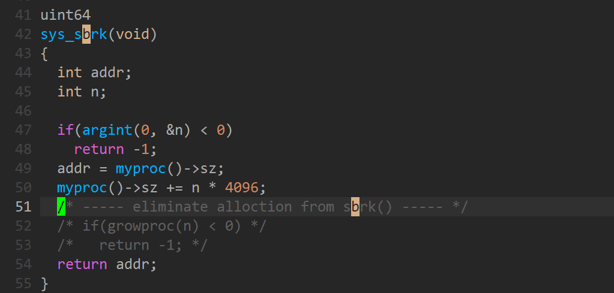

结果是：

在终端 --- echo hi

shell通过fork出一个子进程，通过exec执行相应的操作，exec中需要对新的子程序分配相应的物理内存，但sbrk()中取消了对物理内存的分配，则出现了uvmunmap() panic，即进程已经分配的虚拟地址空间无法映射到实际的物理地址，应该是pagetable中没有相应的PTE。

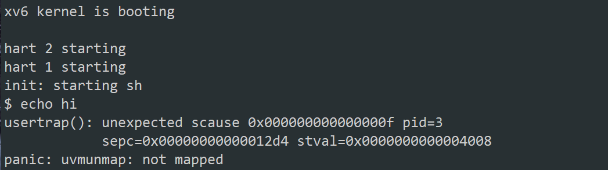

## Lazy allocation ([moderate](https://pdos.csail.mit.edu/6.828/2020/labs/guidance.html))

在part 1中，我们增加了进程的虚拟地址空间，但并未对其分配相应的物理地址空间，于是当进程使用了增加的虚拟地址空间时，由于对PTE标志位vaild bit为0的地址进行访问，会引起page fault，trap进内核空间中。于是可以在/kernel/trap.c --- usertrap()中对这种情况进行处理。

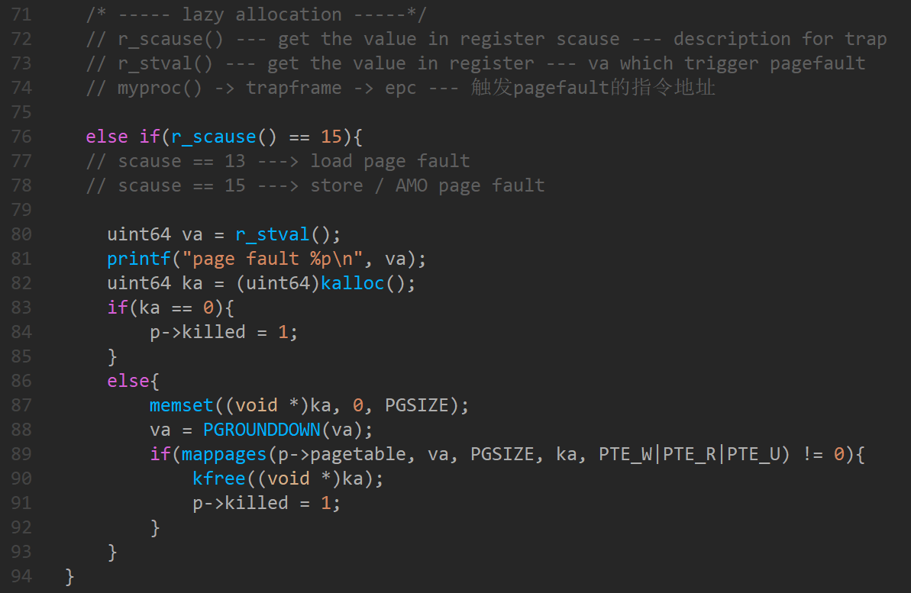

根据scause寄存器中的值确定陷入原因，再对该情况进行相应的处理。

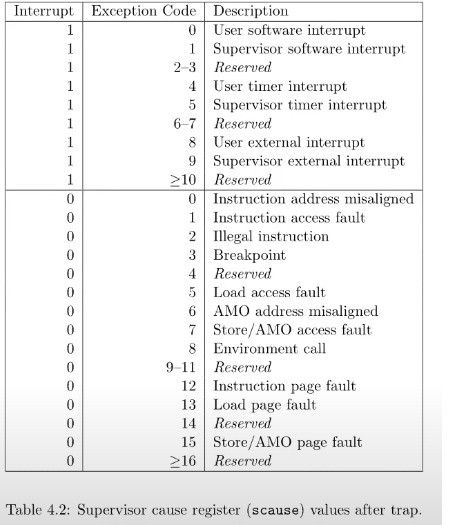

还需要注意的是，若存在已经分配的虚拟地址空间，但进程并未对其进行访问，于是该虚拟地址空间并没有对应的物理地址空间，当进程结束时会调用uvmunmap()将进程的pagetable进行置0并释放相应的物理地址空间。所以需要对原有代码进行更改，使得当可用位为0（虚拟地址空间已经分配，但并未分配相应的物理地址空间）时仍然可以正常退出。

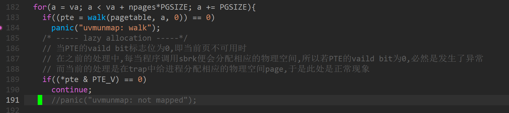

完成之后通过终端进行测试：

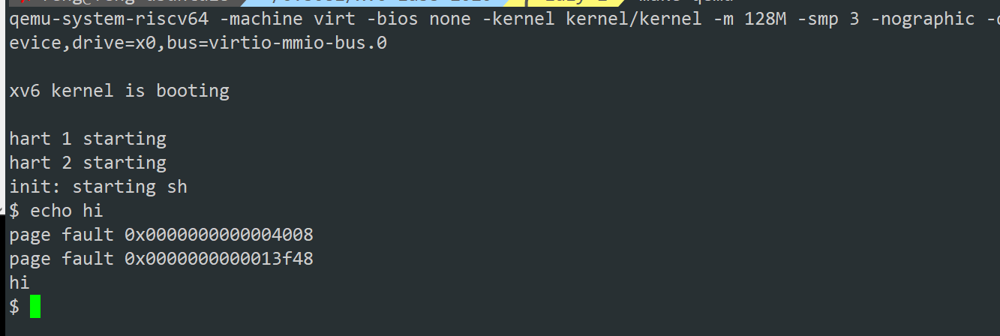

## Lazytests and Usertests ([moderate](https://pdos.csail.mit.edu/6.828/2020/labs/guidance.html))

part 2实现了一个sbrk增加进程虚拟内存空间的版本，但实际情况有很多种，需要使lazy allocation满足如下的情况：

- Handle negative sbrk() arguments.    --- 解决sbrk()接收负参数，即减少进程虚拟空间的功能
- Kill a process if it page-faults on a virtual memory address  higher than any allocated with sbrk().   --- 当一个进程使用了超过sbrk()已经分配的虚拟地址空间时，将该进程终结
- Handle the parent-to-child memory copy in fork() correctly.    --- 正确处理fork()中父进程到子进程的内存拷贝
- Handle the case in which a process passes a valid address  from sbrk()  to a system call such as read or write, but the memory for  that address has not yet been allocated.   --- 
-  Handle out-of-memory correctly: if kalloc() fails in the page fault handler, kill the current process.   --- 当给进程分配物理地址空间时，若kalloc返回0，即物理空间没有剩余的空间，返回0，此时将该进程kill
- Handle faults on the invalid page below the user stack. --- 解决对user stack地址之下虚拟空间访问的异常

1. 解决sbrk()接收负参数，回收进程虚拟地址空间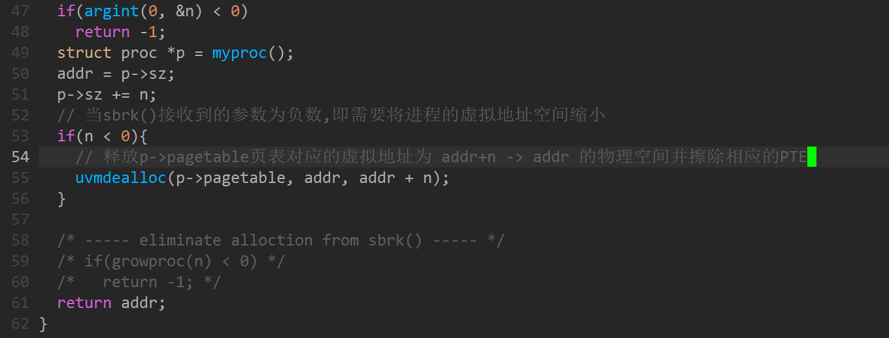

2. 当进程访问非法的地址（超过了进程sz的地址或低于进程sp的地址）时，将进程终结；当没有剩余的物理地址空间分配时，将进程终结。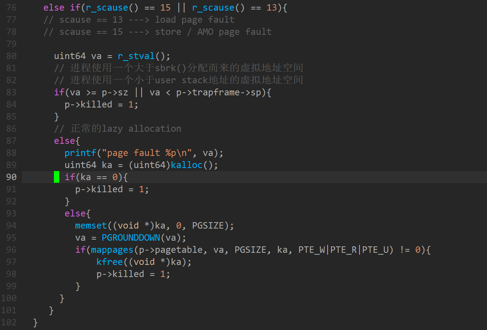

3. 对fork()函数中的父进程到子进程内存拷贝的修改

   原有的fork()函数通过uvmcopy()将父进程的所有物理page拷贝到子进程新分配的物理page中，并将子进程的PTE进行相关的设置。

   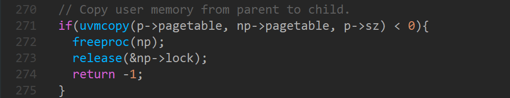

   原有的uvmcopy将父进程的所有物理内存拷贝到子进程

   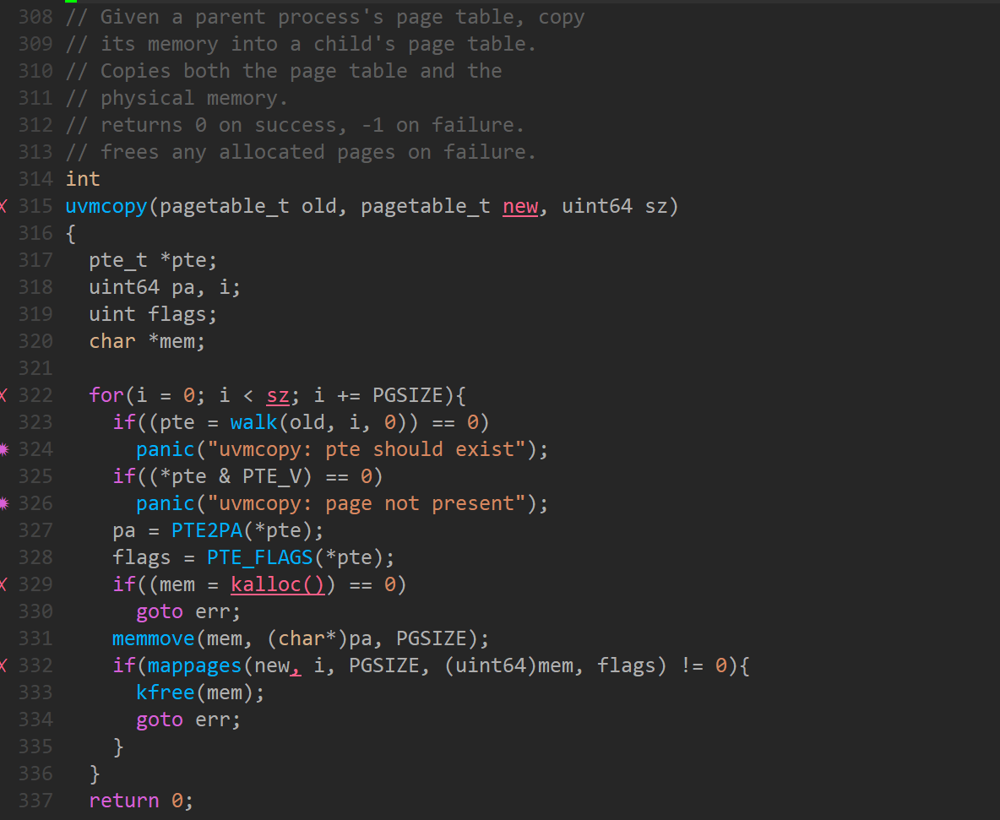

   因lazy allocation的引入，现对其进行修改

   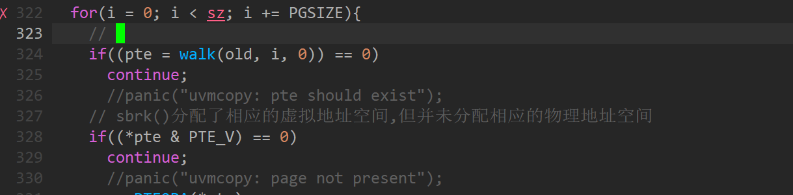

4. 

