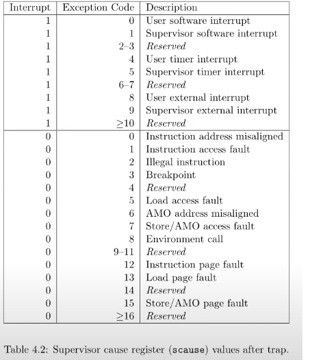
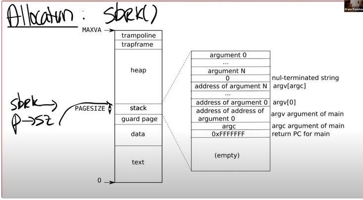
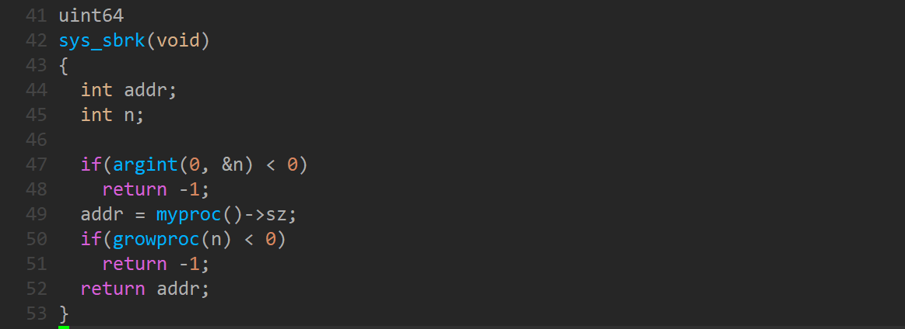
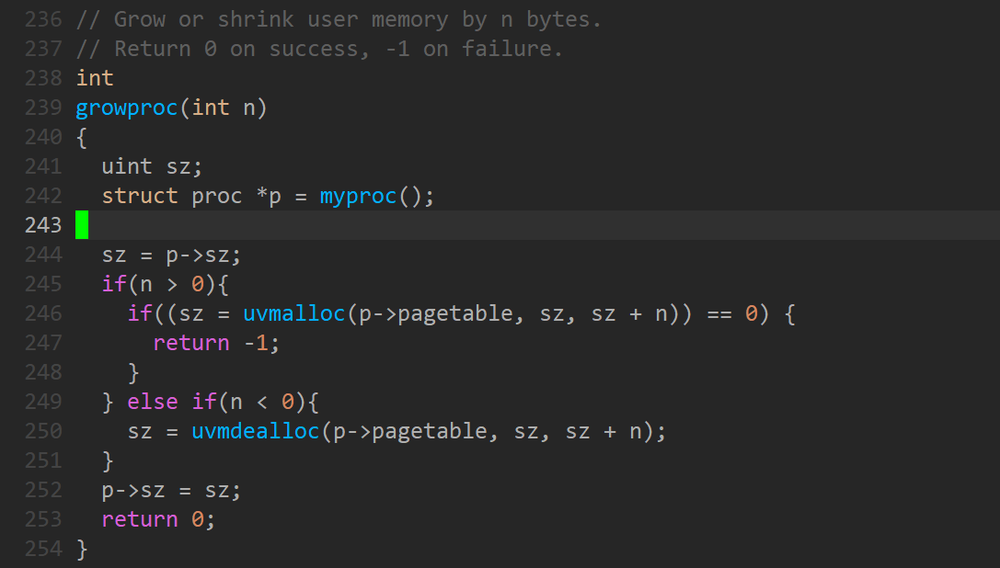
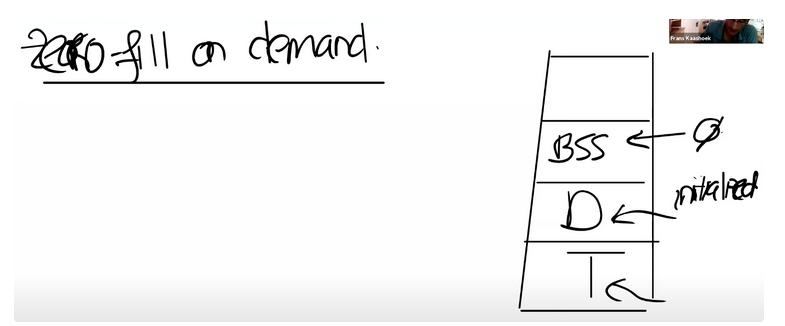
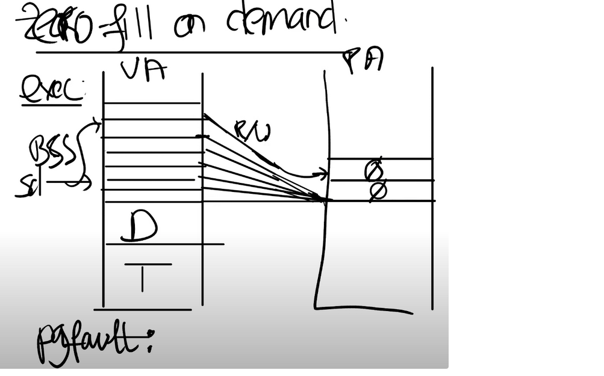
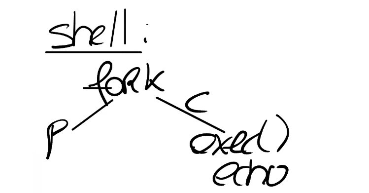
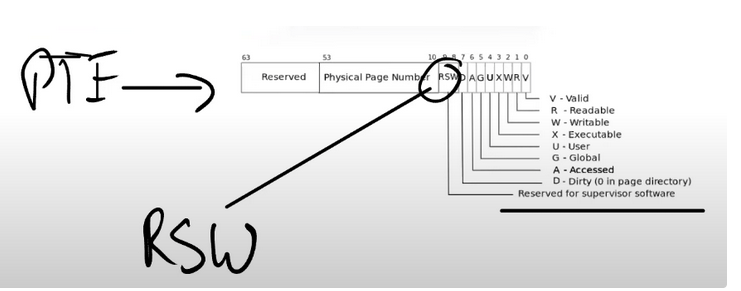

# Page Fault

通过Pae Fault可实现功能：

- lazy allocation
- copy-on-write fork
- demand paging
- memory mapped files

## Page Fault Basics

需要什么信息才能响应page fault

1. 需要触发page fault的源。当出现page falut的时候，XV6内核会打印出错的虚拟地址，并将其保存到STVAL寄存器中

2. 需要知道发生page fault的原因：

   - load page fault
   - store page fault
   - instruction page fault

   在SCAUSE寄存器中保存了trap机制进入supervisor mode的原因

  		3.  触发page fault的指令的地址，存放在SEPC(Supervisor Exception Program Counter)，同时保存在trampframe中的epc中。

## Lazy page allocation

xv6进程的地址分配如下：

​	

sbrk作为xv6中的一个系统调用，代码如下：

通过argint()接收存储在寄存器a0的参数，通过/kernel/proc.c -- growproc()对用户进程的空间大小进行调整。

uvmalloc()中通过kalloc()申请相对应的空间大小，通过mappgaes将所申请的空间映射在pagetable中的新分配的虚拟地址。

sbrk调用后，系统会为进程分配相应的物理内存，应用程序倾向于申请多于自己所需要的内存，意味着进程的内存消耗会增加许多，但是有部分内存永远也不会被用到。

**可以通过虚拟内存和page fault handler来解决内存被这样浪费的问题，这里就是利用lazy allocation**

核心思想：sbrk唯一需要做的事情是提升p->sz，将p->sz增加或减少n个page，但内核在这个阶段不会分配任何物理内存。之后在某个时间点，应用程序使用到了新申请的那部分的内存，将会触发pagefault。通俗的话来说，应用程序允许进程使用的虚拟空间变大了，但该空间实际上还没有得到物理内存，那么我们可以在发生pagefault时去申请相应大小的物理内存。

相应的虚拟地址小于当前*p->sz*，同时大于stack，那么我们就知道这是一个来自于heap的地址，但是内核还没有分配任何物理内存。所以对于这个page fault的响应也理所当然的直接明了：在page fault handler中，通过kalloc函数分配一个内存page；初始化这个page内容为0；将这个内存page映射到user page table中；最后重新执行指令。比方说，如果是load指令，或者store指令要访问属于当前进程但是还未被分配的内存，在我们映射完新申请的物理内存page之后，重新执行指令应该就能通过了。

### Zero Fill On Demand

一个用户程序的地址空间有：

- text区域 --- 程序的指令
- data区域 --- 初始化了的全局变量
- bss区域 --- 未初始化的全局变量

在一个正常的操作系统中，如果执行exec，会申请地址空间，里面会存放text和data。因为bss区域全是未被初始化的全局变量，这里或许有许多page，但page的内容均为0。

可以对其进行优化的地方是：

**如此多的内容全是0的page，在物理内存中，我只需要分配一个page，这个page的内容全是0。然后将所有虚拟地址空间的全0的page都map到这一个物理page上。这样至少在程序启动的时候能节省大量的物理内存分配。**

由此带来的问题是：我们不能对这个物理内存中的页进行写操作，因为所有的虚拟地址空间page都期望page的内容是0，所以此处的PTE都是只读的。在后续应用程序对BSS中某个虚拟页进行写操作时，会产生pagefault，然后在物理内存中申请一个新的page，将其内容全部置为0，之后更行mapping关系。

### Copy On Write Fork

在shell处理指令时，通过fork创建一个子进程执行相应的输入的指令。fork创建一个shell进程的拷贝，所以这时我们有一个父进程和子进程。shell子进程的第一件事是调用exec运行相应指令。fork()出来的子进程会有一个父进程地址空间完整的拷贝，而很多子进程所需执行的操作是和父进程完全不同的，即拷贝过来的地址空间会被马上抛弃，取而代之的是子进程所需的地址空间。

Copy On Write Fork所进行的优化是：调用exec时，共享父进程的物理内存page，设置子进程的PTE指向父进程的物理内存page。

为了保持父进程和子进程的强隔离性，子进程对这些内存的修改应对父进程不可见，父进程对这些内存的修改同样对子进程也不可见。

**隔离性的实现：**

- 将父进程和子进程的PTE标志位均设置为只读
- 当父进程或子进程需要更改内存的内容时，会得到pagefault(对一个标志位为只读的页进行写操作等)
- 当得到pagefault，分配一个新的物理内存page，然后将pagefault相关的物理内存page拷贝到新分配的物理内存page中，并将新分配的物理内存page映射到子进程中，并将PTE标志设置为可读写。然后引发pagefault的页现在只对父进程可见，那么将其PTE标志位设置为可读写的。

事实上，父进程和子进程的地址空间相同，两者对地址空间的写操作引发pagefault的处理是相同的。

PTE中的第8bit到第9bit是保留给内核使用的，可以将第8bit标识为当前是一个copy-on-write page。

当内核在管理这些page table时，对于copy-on-write相关的page，内核可以设置相应的bit位，这样当发生page fault时，我们可以发现如果copy-on-write bit位设置了，我们就可以执行相应的操作了。否则的话，比如说lazy allocation，我们就做一些其他的处理操作。

**需要注意的是**：当多个进程指向同一物理内存page，我们需要判断是否能立即释放相应的物理page，如果子进程还在使用这些物理page，而父进程的终结又释放了该物理page，将会出现问题。我们需要对一个物理page的引用进行计数，当释放虚拟page时对其引用数减1，当引用数为0时释放物理内存page，所以需要引入额外的数据结构对该引用数进行计数。

### Demand Paging

