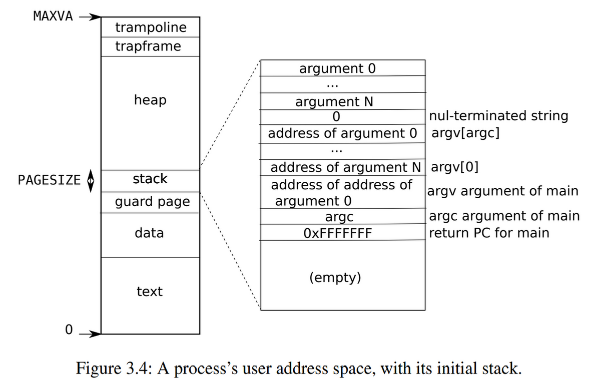
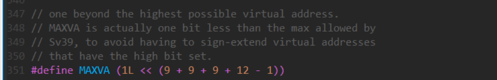
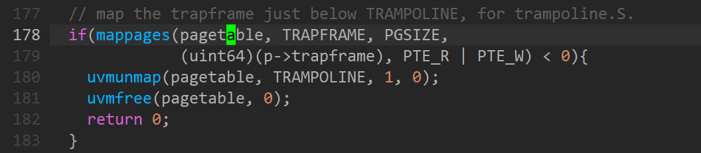
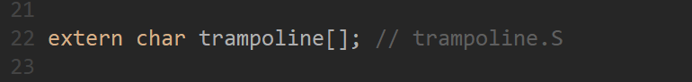
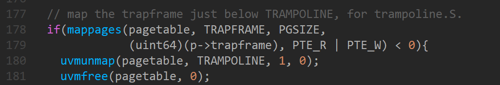

# Xv6 地址空间管理

Xv6有两种模式：管理模式、用户模式，分别对应了内核空间和用户空间。

## 用户地址空间

每个进程都有一个单独的页表，当xv6进行进程切换的同时更改SATP寄存器的值（存放当前根页表的地址）。

每个进程的用户内存从虚拟地址0开始，增长到MAXVA（/kernel/riscv.h:348），xv6的虚拟地址空间为39位，但只用到了其中的低38位，所以MAXVA地址为：

用户空间地址： 0x00000000 - 0x80000000

每个进程都有用户栈和内核栈：

- 用户栈，用户模式下的栈空间 -- myproc()->trapframe->sp
- 内核栈，内核模式下的栈空间 -- myproc()->kstark

内核栈在系统启动时便对其进行初始化，其标志位设置为PTE_R|PTE_W，用户态下不能对其进行访问。

用户栈

### 1. text段

### 2. data段

### 3. guard page

### 4. user stack

### 5. heap

### 6. trapframe

### 7. trampoline

今天时间匆忙，改天继续研究研究。。。。。。 --- 2022-1-2